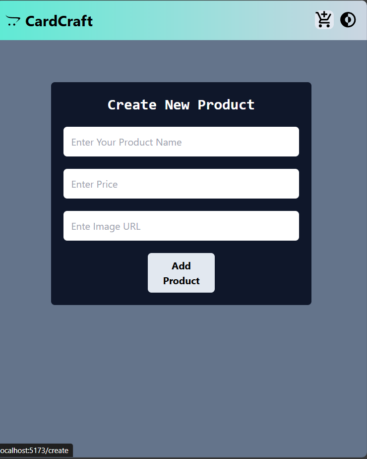
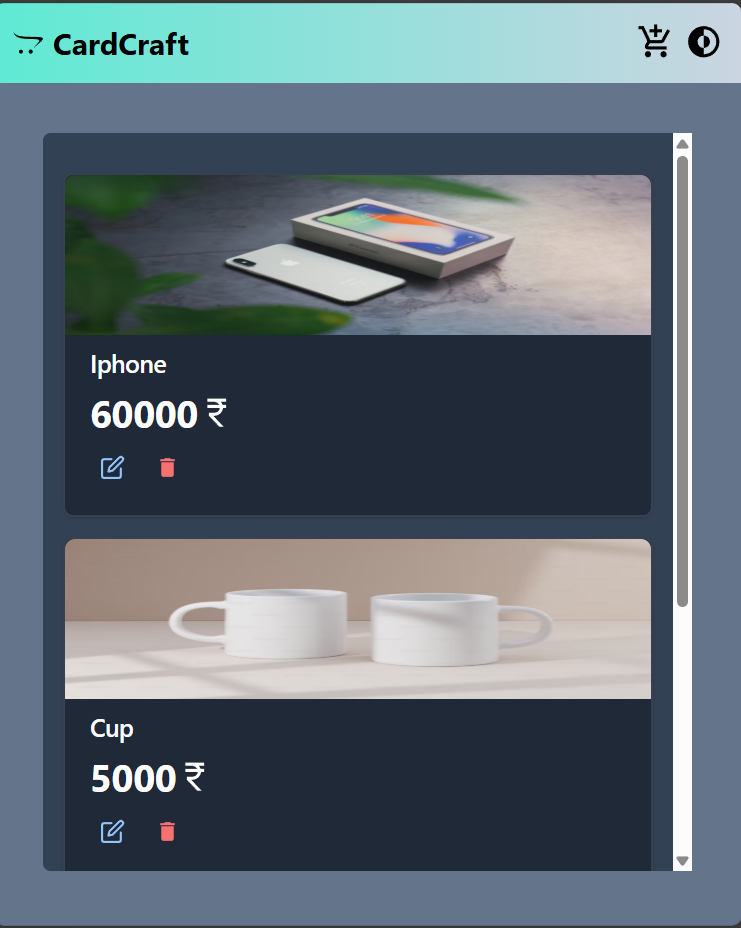

# MERN Product Management App

## Overview
This is a basic MERN application designed for managing products. The application allows users to create, delete, and update product information, including product name, price, and image URL. Built with Chakra UI for styling and Zustand for state management, this app provides a clean and efficient user experience. Note: No login or registration features are included.

## Screenshots
 
## Features
- **Create Product**: Add new products with name, price, and image URL.
- **Delete Product**: Remove products from the list.
- **Update Product**: Edit existing product details.
- **State Management**: Zustand for managing application state efficiently.

## Technologies Used
- **Frontend**: React, Chakra UI
- **State Management**: Zustand
- **Backend**: Node.js, Express.js
- **Database**: MongoDB

   

